# YouTube Roulette — Flow Overview

High-level action chain for every path through a game. Companion to `FLOW.md` (which has every file:line). This doc is for glanceable orientation: "what beat comes next from here?"

Boxes = beats / animations. Diamonds = gates (conditions). Dashed arrows = optional / alt paths.

---

## Master flowchart

```mermaid
flowchart TD
  %% =========== LOBBY ===========
  Lobby([Lobby — Hub shows code + QR])
  Join[Player joins via code]
  Avatar[Player picks avatar / toggles ready]
  Fanfare[Player join fanfare<br/>~2020ms each, queued]
  ReadyGate{All players ready<br/>AND ≥2 players?}

  Lobby --> Join --> Avatar
  Join -.fires.-> Fanfare
  Avatar --> ReadyGate
  ReadyGate -- no --> Avatar
  ReadyGate -- yes, auto-fires on Hub --> Countdown

  %% =========== GAME START ARC (~6.8s) ===========
  Countdown[3 – 2 – 1 – GO!<br/>4200ms<br/>runCountdown]
  Curtain[First up: NAME<br/>1600ms<br/>runCurtain]
  TriggerSearch[/triggerSearch fires<br/>playback_status = searching/]
  Slot[Slot-machine term reveal<br/>per-cell animation<br/>startSlotReveal]
  EdgeFn[/Edge fn returns 20 videos<br/>playback_status = selecting/]
  Grid[Hub: 20-thumbnail grid<br/>Phone: numbered grid]

  Countdown --> Curtain --> TriggerSearch --> Slot --> EdgeFn --> Grid

  %% =========== ACTIVE PLAYER TURN ===========
  Pick[/Active player taps a number/]
  Selection[Selection beat<br/>3000ms<br/>picked tile pop + chip overlay]
  Lift[Studio Card Lift<br/>3580ms total<br/>slab 0-640 → card 840-1220 → hold → dissolve 3220-3580]
  VideoStart[/Hub.playVideo fires at lift +500ms<br/>video begins behind scrim/]
  Playing[Video plays<br/>iframe visible after dissolve]
  GateThumbs{60s thumbs-down<br/>gate elapsed?}
  ThumbsBtn[Skip-vote button enabled on phones<br/>👎 N/T chip on Hub]
  SkipMaj{Skip-vote majority<br/>count > floor total/2?}
  AutoSkip[Hub auto-skip<br/>toast: Skipped by majority vote]
  StopNext[/Active player taps Stop & Next/]
  FinishTurn[/finishTurn writes:<br/>current_player_index++<br/>playback_status = idle<br/>new current_search_term/]

  Grid --> Pick --> Selection --> Lift
  Lift -.T+500ms.-> VideoStart
  Lift --> Playing
  Playing --> GateThumbs
  GateThumbs -- no --> Playing
  GateThumbs -- yes --> ThumbsBtn
  ThumbsBtn --> SkipMaj
  SkipMaj -- yes --> AutoSkip --> FinishTurn
  SkipMaj -- no --> Playing
  Playing --> StopNext --> FinishTurn

  %% Active player superpowers (mid-selecting, optional)
  Reroll[/Reroll term<br/>Replace tile<br/>Swap/]
  Grid -.optional.-> Reroll
  Reroll -.consumes superpower.-> Slot

  %% =========== TURN-TO-TURN ===========
  TurnsLeft{Any players left<br/>this round?}
  TurnBanner[NAME's turn<br/>2800ms<br/>runTurnBanner<br/>Hub.stopVideo fires INSIDE block first]

  FinishTurn --> TurnsLeft
  TurnsLeft -- yes --> TurnBanner --> TriggerSearch
  TurnsLeft -- no, last turn done --> VotingView

  %% =========== VOTING ===========
  VotingView[Voting view<br/>Hub: blind grid of round's videos<br/>Phone: numbered vote grid]
  CastVote[/Each player taps a number/]
  AllVoted{All non-spectator<br/>players voted?}
  Tally[/tallyAndAdvance fires<br/>revealingVotes = true/]
  Cascade[Vote-reveal cascade<br/>1900ms window<br/>200ms stagger × N cards + 700ms pulse]
  Winner[WINNER: NAME<br/>+1 POINT or +2 UNANIMOUS or TIE<br/>2400ms<br/>player-color glow]
  WriteResults[/room.status = results<br/>scores updated/]

  VotingView --> CastVote --> AllVoted
  AllVoted -- no --> VotingView
  AllVoted -- yes --> Tally --> Cascade --> Winner --> WriteResults

  %% =========== RESULTS / NEXT ROUND ===========
  Scoreboard[Scoreboard view<br/>score deltas + Hot Streak badge]
  WinThresh{Any player ≥<br/>win threshold?}
  NextRoundBtn[/Hub or host taps Next Round/]
  NextRound[/nextRound writes room first<br/>status = playing<br/>round++<br/>player_order rotated/]
  RoundBanner[ROUND N / GO!<br/>2400ms<br/>hub-round-overlay]
  CurtainAgain[First up: NAME<br/>runCurtain<br/>uses current_player_index]

  WriteResults --> Scoreboard --> WinThresh
  WinThresh -- no --> NextRoundBtn --> NextRound --> RoundBanner --> CurtainAgain --> TriggerSearch
  WinThresh -- yes --> Finished

  %% =========== END ===========
  Finished[room.status = finished<br/>final winner screen]
  PlayAgain[/Play Again/]
  Finished --> PlayAgain --> Lobby

  %% =========== EDGES (alt paths) ===========
  Refresh[/Hub refreshes mid-game/]
  Rejoin[attemptHubRejoin<br/>resumes via playPlaylist or playVideo]
  ConnLost[/Connection lost/]
  ReconnPill[Reconnecting… pill<br/>forceReconcile on visibilitychange/online]
  AllUnplay{All playlist items<br/>unplayable?}
  Fallback8s[8s fallback timer<br/>tile → UNAVAILABLE<br/>back to selecting]

  Refresh -.-> Rejoin -.-> Playing
  ConnLost -.-> ReconnPill
  Lift -.if playlist.-> AllUnplay
  AllUnplay -- yes --> Fallback8s --> Grid
  AllUnplay -- no --> Playing

  %% Mid-round joiner
  MidJoin[/Player joins mid-round/]
  Spectator[Spectator<br/>can play next round<br/>cannot vote this round]
  MidJoin -.-> Spectator
  Spectator -.next round.-> NextRound
```

---

## Gates (what blocks what)

| Gate | Blocks | Cleared by |
|---|---|---|
| `all players ready AND ≥2 players` | Countdown auto-start | UPDATE on player ready |
| `state._showingCountdown` | slot reveal, search, view changes | countdown's tail (after GO! tail) |
| `state._showingCurtain` | slot reveal, search | curtain's tail (1600ms) |
| `state._showingTurnBanner` | slot reveal, search | banner's tail (2800ms) |
| `state._showingRoundBanner` | slot reveal, search | banner's tail (2400ms) → chains into curtain |
| `state._showingWinnerBanner` | slot reveal (defensive only) | overlay's tail (2400ms) → chains into results write |
| `state._showingSelection` | next playback action | runSelectionThenLaunch's chain to runFlipMorph |
| 60-second thumbs-down gate | skip-vote button + 👎 chip | `Date.now() - video_started_at ≥ 60000` |
| Skip-vote threshold `> floor(total/2)` | auto-skip | majority of eligible voters thumbs-down |
| `state._lastTalliedRound === current_round` | re-firing tally | per-round dedupe token |
| `winnerId !== null` (in WINNER overlay) | TIE branch | tallyVotes outcome |
| `room.status === 'results'` | another tally | until Next Round flips it |
| Spectator (joined mid-round) | voting this round | `nextRound` re-rotates player_order |

---

## Overlaps (things that happen at the same time)

| Beat A | Beat B | Relationship |
|---|---|---|
| Selection beat (3000ms) | Studio Card Lift (3580ms) | **Sequential** — lift starts after selection ends. Total bridge = 6580ms. |
| Studio Card Lift slab (0–640ms) | `.now-playing-card` | Card hidden during slab expand. Card pops in at 840ms (after 200ms breath). |
| Card lift hold (1420–3220) | `Hub.playVideo` (fires at +500ms = T+500) | Iframe loads + buffers behind scrim during hold. User sees only the card. |
| Card lift dissolve (3220–3580) | Iframe video | Video already playing; scrim fades to reveal it mid-playback. Audio leak window now ~1s instead of ~3s. |
| Vote cascade (1900ms) | `revealingVotes = true` flag | Flag stays set throughout; `data-revealed="true"` blocks morphdom from re-triggering pulse. |
| Round banner tail (2400ms) | `runCurtain` chain | Sequential — curtain starts AFTER banner clears. No `triggerSearch` from banner tail (curtain's tail owns it). |
| Turn banner (2800ms) | `Hub.stopVideo()` | `stopVideo` fires INSIDE the H1 block BEFORE `runTurnBanner` so iframe doesn't cover the banner. Same paint frame. |
| Player join fanfare (~2020ms) | Other lobby renders | Queued — multiple joins fanfare one at a time, not simultaneously. |
| 1Hz `_thumbsGateInterval` ticker | Phone render | Drives the visible countdown text on the disabled skip-vote button. |
| 250ms hub video timer tick | Hub render | `data-morph-skip="true"` on the timer pill so morphdom doesn't clobber the textContent update. |

---

## Key chains (the canonical paths)

**Game start (turn 1, round 1):**
`all ready` → countdown (4200ms) → curtain (1600ms) → triggerSearch → slot reveal → grid

**Mid-round turn change (turn 2+ of any round):**
`finishTurn` → realtime echo → `Hub.stopVideo()` → turn banner (2800ms) → triggerSearch → slot reveal → grid

**Round change (round 2+ entry):**
`nextRound` → realtime echo → ROUND N / GO! (2400ms) → curtain (1600ms) → triggerSearch → slot reveal → grid

**Selection → playback:**
pick → selection beat (3000ms) → card lift (3580ms with video starting at +500ms) → playing

**Voting → results:**
all voted → tally → cascade (1900ms) → WINNER (2400ms) → status=results → scoreboard

**End of game:**
score ≥ threshold on tally → status=finished → final screen → Play Again → lobby

---

## Where each beat lives in the codebase

| Beat | File | Function |
|---|---|---|
| Countdown | `js/app.js` | `runCountdown` |
| Curtain | `js/app.js` | `runCurtain` |
| Turn banner | `js/app.js` | `runTurnBanner` |
| Round banner | `js/app.js` | inline in `handleRoomChange` results→playing |
| Slot reveal | `js/app.js` | `startSlotReveal` |
| Selection beat | `js/app.js` | `runSelectionThenLaunch` |
| Studio Card Lift | `js/app.js` | `runFlipMorph` (name retained, transition entirely different) |
| WINNER overlay | `js/app.js` | inline in `tallyAndAdvance` |
| Vote cascade | `css/styles.css` | `voteRevealPulse` + nth-child stagger |
| Iframe lifecycle | `js/hub.js` | `playVideo`, `playPlaylist`, `setFirstPlayCallback` |

---

For full file:line references, exact ms timings of every keyframe, and state-flag set/clear locations: see `FLOW.md`.
