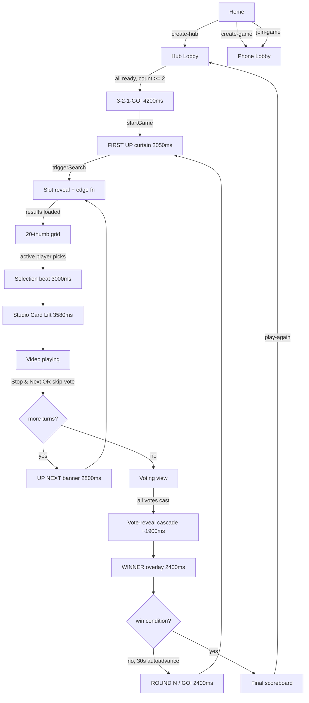

# YouTube Roulette — Canonical Game Flow Reference

This document is the **source of truth for what's *supposed* to happen at each beat** of a YouTube Roulette game. Future sessions diff observed behavior against this doc to spot regressions.

- All file:line references are absolute to the project root.
- Cache-bust at time of writing: `?v=52`.
- This doc covers what's shipped through Batches A–H + Studio Card Lift refinements.

---

## 1. Glossary

### Roles

| Term | Meaning |
|------|---------|
| **Hub** | A TV/desktop browser running the room as the display surface. `state.isHub === true`. Created via `createHubRoom` (`js/app.js:683`). The Hub is also the host (its `playerId === room.host_id`). |
| **Player** | A phone connected to the room. Tap-driven UI. Created via `joinRoom` (`js/app.js:725`). |
| **active player** | The player whose turn it is. `state.room.player_order[state.room.current_player_index]`. They pick the video; everyone else watches. |
| **host** | The owner of the room. `state.room.host_id === state.playerId`. For Hub rooms this is always the Hub. For phone-created rooms it's the creating phone. Tested via `isHost()` at `js/app.js:1542`. |
| **spectator** | A player whose `id` is NOT in `state.room.player_order`. They joined mid-round. They render the game UI but cannot vote (`castVote` early-returns at `js/app.js:1824`) and cannot use thumbs-down (`toggleThumbsDown` at `js/app.js:1616`). They become full participants the next time `player_order` is rebuilt — i.e. when `nextRound` runs. |
| **room** | Database row in `yt_rooms` keyed by 4-char `code`. |
| **turn** | One active player's pick → play → stop cycle. Indexed by `current_player_index`. |
| **round** | All players take a turn, then everyone votes. Indexed by `room.round`. |

### Lifecycle states — `room.status`

| Value | Meaning | Renders |
|-------|---------|---------|
| `lobby` | Room exists, players joining, not yet started. | `renderHubLobby` / `renderLobby` |
| `playing` | A turn is in progress (search → select → play → stop loop). | `renderHubGame` / `renderGame` |
| `voting` | All turns done; everyone votes. | `renderHubVoting` / `renderVoting` |
| `results` | Vote tallied; scoreboard shown; 30s auto-advance to next round. | `renderHubResults` / `renderResults` |
| `gameover` | Someone hit `win_score`. Final scoreboard. | `renderHubGameOver` / `renderGameOver` |

`viewForStatus` (`js/app.js:1534`) maps `status` → view name. `host-ended` is a phone-only synthetic view triggered by `handleRoomChange` DELETE branch (`js/app.js:841`).

### Playback states — `room.playback_status` (only used while `status === 'playing'`)

| Value | Meaning |
|-------|---------|
| `idle` | Between turns. Hub renders empty `.hub-main` (no grid flash). Set by `finishTurn`, `nextRound`, `playAgain`, `useReroll`, `useReplace`, `useSwap`, `kickPlayer` (current-player branch). |
| `searching` | Edge function in flight. Hub renders the slot-machine term reveal. Set optimistically in `triggerSearch` (`js/app.js:1285`) and `showView` (`js/app.js:1373`); also via M1 echo branch in `handleRoomChange` (`js/app.js:972`). |
| `selecting` | Search returned, 20-thumb grid up, waiting for active player to tap. Set by `triggerSearch` after results write (`js/app.js:1335`). |
| `playing` | Active player picked; `Hub.playVideo` / `playPlaylist` is going to fire. Set by `selectVideo` (`js/app.js:1741`). |
| `stopped` | Video ended naturally (YT iframe state 0) without `Stop & Next`. Set by `Hub.initPlayer` onEnd callback (`js/app.js:596`, `:701`) and admin `skipPlayer` (`js/app.js:2100`). |
| `search_failed` | Edge function returned no results. Set by `triggerSearch` error branch (`js/app.js:1300`). |

### Render-only / orchestration flags

All declared in the `state` object at `js/app.js:31-80`. All reset in `clearSession` (`js/app.js:503-559`).

| Flag | Set | Cleared | Gates |
|------|-----|---------|-------|
| `_showingCountdown` | `runCountdown` entry (`:205`) | `runCountdown` GO! tail (`:266`); `abortCountdown` (`:278`) | Suppresses `triggerSearch`, suppresses Hub auto-start, suppresses turn banner, suppresses term-change re-search in poll (`:475`). |
| `_countdownTimeouts` | `scheduleCountdown` push (`:199`) | `runCountdown` GO! tail; `abortCountdown` | Tracks countdown setTimeouts so they can all be cleared. |
| `_showingCurtain` | `runCountdown` BEFORE `startGame` await (`:264`); `runCurtain` (re-asserts at `:289`) | `runCurtain` setTimeout tail (`:318`); DELETE branch if <2 players (`:1043`) | Suppresses `triggerSearch` in `showView`, `render`, `runTurnBanner` tail. Hub turn-banner branch in `handleRoomChange` checks `!_showingCurtain` (`:916`). |
| `_curtainTimeout` | `runCurtain` (`:316`) | `runCurtain` tail (`:317`); `clearSession` | — |
| `_joinBannerQueue` | `enqueueJoinBanner` (`:330`) | `runJoinBanner` shift (`:340`) | — |
| `_joinBannerActive` | `runJoinBanner` (`:339`) | `runJoinBanner` empty-queue (`:336`) | Whether a join banner is currently visible. |
| `_joinBannerTimeout` | `runJoinBanner` (`:362`) | `runJoinBanner` tail; `clearSession` | — |
| `_justJoinedIds` | `handlePlayerChange` INSERT for non-self (`:989`) | 600ms setTimeout (`:992`) | Drives card slide-in CSS class for new joiners in lobby. |
| `_justLoadedCells` | Phone-only: `handleRoomChange` when `oldResultsLen===0 && newResultsLen>0` (`:880`) | 250ms setTimeout (`:883`) | Phone num-grid stagger fade-in. |
| `_termJustRevealed` | Phone-only: `handleRoomChange` term-change branch (`:901`) | 500ms setTimeout (`:904`) | Phone slot-cell reveal replay. |
| `_turnJustStartedForMe` | Phone-only: `handleRoomChange` index-change branch (`:891`); `showView` turn-1 branch (`:1384`) | 1400ms setTimeout | Drives `data-turn-just-started` attr on phone turn info block. |
| `_justReadiedIds` | `handlePlayerChange` UPDATE wasReady→isReady, non-self (`:1005`) | 600ms setTimeout | Drives `cardReadyPulse` / `cardReadySweep` animations on lobby card. |
| `_resultsAnimated` | `showView` results branch 1400ms setTimeout (`:1397`) | `showView` lobby/game branch (`:1402`) | Run-once gate for results bloom. |
| `_showingTurnBanner` | `runTurnBanner` (`:377`) | `runTurnBanner` 2800ms tail (`:386`); `clearSession` | Suppresses optimistic searching flip in `handleRoomChange` term-change branch (`:971`); suppresses `triggerSearch` in same branch (`:975`); suppresses slot-reveal in `render` (`:1505`); `renderHubGame` renders empty main while up (`js/ui.js:669`). |
| `_turnBannerTimeout` | `runTurnBanner` (`:384`) | tail; `clearSession` | — |
| `_autoAdvanceTimer` | `showView` results branch (`:1414`) | tail when countdown <= 0; `showView` entry; `clearSession` | 30s next-round auto-advance interval. |
| `_connStatus` | `setConnStatus` (`:771`) | `clearSession` | Drives `#conn-pill-host` reconnect pill. Values: `'ok'`, `'reconnecting'`. |
| `_skipVoteFiring` | `handlePlayerChange` skip-vote threshold cross (`:1028`) | finally block after `stopAndNext` (`:1033`); `clearSession` | Debounces multiple `thumbs_down` echoes from triggering `stopAndNext` multiple times. |
| `_thumbsGateInterval` | `startThumbsGateTicker` (`:175`) | `stopThumbsGateTicker` (`:188`); `clearSession` | 1Hz ticker driving phone skip-vote countdown. Stopped when `playback_status` leaves `playing` or gate elapsed. |
| `_showingSelection` | `runSelectionThenLaunch` (`:1095`) | 3000ms tail in same fn (`:1100`); `clearSession` | Forces `renderHubGame` to fall through to selecting branch (so picked tile + chip stay visible) instead of switching to playing-empty-main (`js/ui.js:653`). |
| `_selectionTimeout` | `runSelectionThenLaunch` (`:1097`) | tail; `clearSession` | — |
| `_launchingVideo` | `runFlipMorph` (`:1224`) | 3580ms cleanup setTimeout (`:1253`); `clearSession` | Same fall-through gate as `_showingSelection` for the Studio Card Lift duration (`js/ui.js:653`). |
| `_launchingTimeout` | `runFlipMorph` (`:1247`) | tail; `clearSession` | — |
| `_showingRoundBanner` | `handleRoomChange` results→playing branch (`:942`) | 2400ms tail (`:945`); `clearSession` | Suppresses `triggerSearch` in `showView`, `render`, term-change branch. Banner tail chains `runCurtain`. |
| `_roundBannerTimeout` | `:944` | tail; `clearSession` | — |
| `_playlistFallbackTimer` | `armPlaylistFallback` (`:1114`) | first-play callback (`:604`, `:707`); same fn cancel; `clearSession` | 8s timeout marking playlist unplayable if first-play never fires. |
| `_videoStartTimeout` | `runFlipMorph` 500ms deferred-load setTimeout (`:1149`, `:1180`) | tail; `clearSession` | 500ms delay between scrim setup at T+0 and the actual `Hub.playVideo`/`playPlaylist` call so YT load latency lines up with dissolve at T+3220. |
| `_showingWinnerBanner` | `tallyAndAdvance` (`:1893`) | 2400ms `await` window (`:1927`); `clearSession` | Suppresses `triggerSearch` in `render` slot-reveal call site. |
| `_winnerBannerTimeout` | `tallyAndAdvance` (`:1921`) | resolved-promise tail; `clearSession` | — |
| `revealingVotes` | `tallyAndAdvance` (`:1875`) | `tallyAndAdvance` after 1900ms wait, BEFORE room status write (`:1886`); finally block (`:1944`) | Drives `.hub-vote-count--reveal` class in `renderHubVoting`. **Cleared in tight scope, not finally**, per Pattern 6 — finally clears as defense-in-depth. |
| `_lastTalliedRound` | `tallyAndAdvance` after vote calc (`:1873`) | `clearSession` | Per-round dedupe token. Prevents the realtime echo on the score-write from re-entering `tallyAndAdvance` for the same round. |
| `_avatarWriteTimer` | `cycle-avatar` action (`:2224`) | `clearSession` | 300ms debounce on avatar DB writes. |
| `isProcessing` | `startGame`, `tallyAndAdvance`, `nextRound` (entry); `forceReconcile` no | finally blocks of same; `handleRoomChange` status-change branch (`:932`) | Generic guard against double-entry of multi-write actions. |
| `isSearching` | `triggerSearch` (`:1271`) | `triggerSearch` finally (`:1342`) | Prevents reentry of `triggerSearch`. |
| `confirmLeave` | `leaveGame` for Hub/host (`:2012`); `confirmEndGame` clears (`:2023`); `cancelEndGame` clears | — | Mounts `renderConfirmLeave` overlay. |

### Timer handles (cleared in `clearSession`)

`_pollInterval` is the **only** timer NOT cleared in `clearSession` — it's page-lifetime (`js/app.js:497`). Its callbacks early-return on `!state.roomCode` (Pattern 4).

---

## 2. High-level lifecycle diagram



---

## 3. Per-phase detailed flow

### A. Lobby

#### A.1 Hub creates room — `createHubRoom` (`js/app.js:683`)

1. **Trigger:** user clicks `[data-action="create-hub"]` on the home view.
2. **DB writes:**
   - `INSERT yt_rooms { code, host_id: state.playerId, status: 'lobby', win_score, is_hub: true }`.
3. **Local state:** `isHub = true; roomCode = code`. `localStorage.yt_room_code` + `yt_is_hub`.
4. **YT player init:** `Hub.initPlayer` registers `onEnd` (sets `playback_status: 'stopped'`); `Hub.setFirstPlayCallback` registers `video_started_at` write + playlist video-id capture.
5. **Subscribes** via `subscribeToRoom`. `showView('lobby')`.
6. **No player row written** — Hub is host but has no avatar/score row.

#### A.2 Player joins — `joinRoom` (`js/app.js:725`)

1. **Trigger:** `[data-action="join-game"]` with name + 4-char code.
2. **Validations:** room exists, not `gameover`, name not taken in this room.
3. **DB writes:** `INSERT yt_players { id, room_code, name, avatar }` (random emoji from `EMOJI_AVATARS`).
4. **Mid-game branch:** `isMidGame = room.status !== 'lobby'`. The player is NOT added to `player_order` — they're a spectator until next round.
5. **Local state:** `playerName`, `roomCode`, localStorage. `subscribeToRoom`. `showView(viewForStatus(room.status))`.
6. **Realtime echo on Hub:** `handlePlayerChange` INSERT branch → `_justJoinedIds.add(...)` + `enqueueJoinBanner` (Hub-only). 600ms card-slide CSS animation on the lobby card.

#### A.3 Player picks emoji avatar — `cycle-avatar` action (`js/app.js:2215`)

1. **Trigger:** tap on `.player-avatar--cyclable` (only own player's avatar in lobby; only in `lobby` status).
2. **Optimistic local:** `me.avatar = nextAvatar; render()` — Pattern 2 canonical example.
3. **Debounced DB write:** `_avatarWriteTimer` setTimeout 300ms → `UPDATE yt_players SET avatar = ?`.
4. Fast double-tap cycles locally without firing two writes.

#### A.4 Player toggles ready — `toggleReady` (`js/app.js:1605`)

1. **DB write:** `UPDATE yt_players SET ready = !me.ready`.
2. **Realtime echo on Hub:** `handlePlayerChange` UPDATE branch.
   - On `false → true` for non-self: `_justReadiedIds.add` + 600ms timeout → `cardReadyPulse` 320ms + `cardReadySweep` 600ms CSS animations.
   - On `true → false` while countdown is running: `abortCountdown` (`:1013`).

#### A.5 Auto-start trigger conditions

Two paths into `runCountdown`:
1. **Realtime path** — `handlePlayerChange` UPDATE tail (`js/app.js:1062`):
   ```
   isHub && status === 'lobby' && !_showingCountdown
     && players.length >= 2 && players.every(p => p.ready)
   ```
2. **Safety net** — 2s `_pollInterval` callback (`js/app.js:492`) with the same check. Catches the case where the Hub refreshed while everyone was already ready (no realtime UPDATE arrives to fire the realtime path).

Both routes go through `runCountdown` (NOT `startGame` directly), so the 3-2-1-GO arc plays on both paths.

#### A.6 Player join fanfare — `_justJoinedIds` + `enqueueJoinBanner`

- INSERT-only trigger; skips own player.
- Phone side: `_justJoinedIds` flag drives card slide-in (`playerJoinIn` keyframe, 0.52s).
- Hub side: `enqueueJoinBanner` → `runJoinBanner` shows bottom banner with avatar + "[NAME] joined", **2300ms**, queued.

#### A.7 Host leaves lobby — `leaveGame` → `confirmEndGame` (`js/app.js:2009-2027`)

1. **Hub or phone-host:** `state.confirmLeave = true; render()` mounts overlay.
2. On confirm: `DELETE yt_rooms WHERE code = ?` cascades player rows. `clearSession`. `showView('home')`.
3. **Other phones** receive `handleRoomChange` DELETE → set `currentView = 'host-ended'`, render the `host-ended` view.

---

### B. Game Start — the 6.8s arc

Starts when auto-start fires; ends when the first thumbnail grid appears. Total ~4.2s countdown + ~2.05s curtain + slot reveal (which overlaps with the search) ≈ 6.8s before the grid.

#### B.1 Countdown — `runCountdown` (`js/app.js:203`)

Total 4200ms.

| T+ | Event | Visible |
|----|-------|---------|
| 0 | "3" set + tickFlash + `is-pulsing` overlay class | Big "3" via `tickThree` keyframe (700ms) |
| 1000 | "2" | `tickTwo` keyframe |
| 2000 | "1" | `tickOne` keyframe |
| 3000 | GO! structure (`hub-go__flash` + `hub-go__shake` + 2 rings + text). Removes `is-pulsing`, adds `hub-overlay--go-flash` for 300ms | `goFlash` 280ms + `goShake` 380ms + `goRingInner` 600ms + `goRingOuter` 800ms@80ms + `goImpact` 1200ms |
| 4200 | (1200ms after GO!): `_showingCurtain = true`; `await startGame()`; clear flags + overlay; `runCurtain()` | — |

Aborted by `abortCountdown` if a player un-readies or count drops below 2 (`handlePlayerChange` `:1012`, `:1039`).

#### B.2 Curtain — `runCurtain` (`js/app.js:285`)

Total 2050ms. Reads `current_player_index` from optimistically-updated `state.room` (set in `startGame` finally — `js/app.js:1593`).

DOM:
```
<div class="hub-curtain" style="--player-color:...">
  <div class="hub-curtain-bar"></div>            <!-- curtainBarIn 250ms -->
  <div class="hub-curtain-label">FIRST UP</div>  <!-- curtainLabelIn 200ms@150ms -->
  <div class="hub-curtain-name">Name</div>       <!-- nameSlam 500ms@350ms + nameExit -->
  <div class="hub-curtain-underline">
    <div class="hub-curtain-underline-shine"></div>  <!-- shine 350ms@600ms -->
  </div>
  <div class="hub-curtain-sparks">×6</div>
</div>
```

**Tail at 2050ms** (`:316`): clears `_showingCurtain`, clears overlay; if Hub + status playing + (searching | idle) + !isSearching → `triggerSearch()`.

#### B.3 `startGame` (`js/app.js:1570`)

Two writes (player-first is OK here because the Hub has no rendered view-state echo for player resets at the lobby→playing transition; `_showingCurtain` claimed BEFORE the room write at the call site at `:264`):

1. **Players bulk reset:**
   ```
   UPDATE yt_players WHERE room_code = ?
     SET ready=false, score=0,
         has_reroll=true, has_replace=true, has_swap=true,
         selected_video=null, vote_for=null,
         picked_video_id=null, picked_video_title=null, picked_video_thumbnail=null,
         thumbs_down=false
   ```
2. **Room flip:**
   ```
   UPDATE yt_rooms SET
     status='playing', player_order=shuffled, current_player_index=0,
     current_search_term=newTerm, round=1, past_terms=[],
     search_results=[], selected_video_index=null, selected_video_id=null,
     playback_status='idle', last_round_winner=null, streak_count=0
   ```
3. **Optimistic local update** of `state.room.player_order/current_player_index/current_search_term/round` so `runCurtain` can read player_order without waiting for echo.

#### B.4 `triggerSearch` (`js/app.js:1269`)

1. **Gate:** `!state.isHub || state.isSearching` early-returns. Sets `isSearching = true`.
2. **`searchStartTime = performance.now()`** anchors the slot-reveal min-time clock UNCONDITIONALLY (M1 fix).
3. **Optimistic flip** to `playback_status = 'searching'` if not already; `render()`.
4. **DB write** `UPDATE yt_rooms SET playback_status = 'searching'` (echoes back; usually a no-op since local already matches).
5. **Edge function call:** `db.functions.invoke('youtube-search', { body: { term, videoOnly: false } })`.
6. **`Hub.buildPool`** filters per the 3-video rule.
7. **Fallback search** if `pool.filter(type='video').length < 3`: re-invoke with `videoOnly: true`, merge.
8. **Pool numbering:** each item gets `index: i`.
9. **Hold gate** — wait until `performance.now() - searchStartTime >= SLOT_REVEAL_MIN_MS (2800ms)` so the reveal always plays in full.
10. **DB write:**
    ```
    UPDATE yt_rooms SET
      search_results=pool, selected_video_index=null, selected_video_id=null,
      playback_status='selecting'
    ```
11. **Finally:** `isSearching = false`. Re-fires if `currentTerm !== term` (rapid superpower chain).

#### B.5 Slot-machine reveal — `startSlotReveal` (`js/app.js:101`)

Constants (`js/app.js:92-97`):
- `SLOT_TICK_MS = 80`
- `SLOT_FIRST_LOCK_MS = 600`
- `SLOT_STAGGER_MS = 400`
- `SLOT_HOLD_AFTER_LOCK_MS = 1000`
- `SLOT_REVEAL_MIN_MS = 600 + 3*400 + 1000 = 2800`

Per cell (4 cells):
- T+0: cell gets `.hub-char--rolling`; ticks every 80ms cycling random char.
- T+`600 + i*400`: lock — clear interval, write `data-final-char`, swap class to `--locked`, fire `hubCharLock` 250ms keyframe.

Cells' DOM emitted by `renderHubGame` searching branch (`js/ui.js:710`): `<span class="hub-char" data-final-char="X">X</span>`. Initial classes are bare; JS adds `--rolling` then `--locked`. The `onBeforeElUpdated` morphdom callback skips updates on rolling/locked cells unless `data-final-char` differs (term changed).

Call sites for `startSlotReveal`:
- `render()` slot-reveal gate (`js/app.js:1505`) — fires when `currentView==='game' && playback_status==='searching' && !showingCurtain && !showingCountdown && !showingRoundBanner && !showingTurnBanner && !showingWinnerBanner`.

#### B.6 Hub thumbnail grid render

Once `playback_status = 'selecting'` echoes back, `handleHubPlaybackChange` → `debouncedRender` → `renderHubGame` selecting branch (`js/ui.js:737`). Phone simultaneously gets `renderGame` num-grid via the same echo.

---

### C. Active player's turn

#### C.1 Player taps a number — `selectVideo` (`js/app.js:1706`)

1. **Pre-write player sweep** (`:1730`): `UPDATE yt_players SET thumbs_down = false WHERE room_code = ?` — clears stale skip votes BEFORE the room write so the Hub's gate-on-new-video reads clean votes.
2. **Pattern 1 — room first** (`:1737`):
   ```
   UPDATE yt_rooms SET
     selected_video_index=index,
     selected_video_id=videoId,         -- seed; first-play callback overwrites for playlists
     selected_playlist_id=isPlaylist ? video.playlistId : null,
     playback_status='playing',
     video_started_at=null
   ```
3. **Player write** (`:1752`): `UPDATE yt_players SET picked_video_id, picked_video_title, picked_video_thumbnail`.
4. **Rollback path** if player write fails: revert room to `playback_status='selecting'` etc.

#### C.2 Hub realtime echo → `runSelectionThenLaunch` (`js/app.js:1087`)

`handleRoomChange` playback-change branch → `handleHubPlaybackChange` → `runSelectionThenLaunch`:

1. **3000ms selection beat** with `_showingSelection = true`. `renderHubGame` falls through to selecting branch (`ui.js:653`) to keep grid visible.
2. **Visible at T+0–3000:**
   - Picked tile: `.hub-thumb--picked` + `data-morph-skip="true"` + `--player-color` inline. CSS: `transform: scale(1.08)`; outline 3px; `hubPickPulse` 360ms × 3 with 180ms delay; `hubNumPunch` 200ms@180ms on number badge.
   - Other tiles: `.hub-thumb--others-dimmed` — `filter: blur(2px) brightness(0.5)`, `transform: scale(0.96)`.
   - Pick chip: `.hub-pick-chip` centered IN the picked tile, 56px avatar + "[NAME] PICKED #N" with `pickChipIn` 360ms@180ms cubic-bezier overshoot. Player-color border + glow.
3. **At T+3000** (`:1100`): `_showingSelection=false`; `runFlipMorph(idx, videoId)`.

#### C.3 Studio Card Lift — `runFlipMorph` (`js/app.js:1143`)

Total **3580ms** (after the 3000ms selection beat). Bridge from selection to video: 3000+3580 = **6580ms (~6.6s)**.

DOM (appended to `body` outside `#app`):
```
<div class="np-stage" style="--player-color:...">
  <div class="np-scrim"></div>           <!-- black, opacity 1 -->
  <div class="np-slab"
       style="clip-path:inset(top right bottom left round 18px)"></div>
  <div class="now-playing-card">
    <div class="np-avatar">{emoji}</div>
    <div class="np-eyebrow">NOW PLAYING | QUEUEING PLAYLIST</div>
    <div class="np-title">{video title}</div>
    <div class="np-footer">#N · {playerName}</div>
  </div>
</div>
```

Choreography:

| T+ | Beat | Detail |
|----|------|--------|
| 0 | Stage built; scrim opaque (covers iframe loading); slab clip-path = picked tile rect; `_launchingVideo=true`; original chip fades 80ms→0; `np-stage--lifting` class added | Iframe will load behind the scrim |
| 360 | Slab transition delay elapses → 280ms `clip-path` morph to fullscreen (cubic-bezier 0.65,0,0.35,1) | Slab blooms; card still hidden (opacity 0) |
| 500 | `_videoStartTimeout` fires: `Hub.playPlaylist(playlistId)` if playlist (also `armPlaylistFallback`), else `Hub.playVideo(videoId)`. (Deferred so YT load latency lines up with the dissolve at T+3220 instead of leaking audio mid-hold.) | — |
| 640 | Slab clip-path transition ends | Just the colored slab visible |
| 640–840 | 200ms breath | Slab only |
| 840 | `npCardReveal` 380ms@840ms cubic-bezier(0.22,1,0.36,1) starts | Card fades in + scale 0.94→1.0 |
| 1080 | `npTextRise` 180ms on `.np-eyebrow` | Eyebrow rises |
| 1140 | `npTextRise` 220ms on `.np-title` | Title rises |
| 1240 | `npTextRise` 180ms on `.np-footer` | Footer rises |
| 1420 | All text settled | Hold begins |
| 1420–3220 | 1800ms cinematic hold | Card + slab fully composed |
| 3220 | `np-stage--dissolving` class added: scrim opacity 1→0 (360ms linear); slab opacity 1→0 (360ms linear); card filter blur 0→6px + scale 1→1.04 + opacity 1→0 (280ms cubic) | Avatar transition-delay 80ms (holds last) |
| 3580 | Cleanup: `_launchingVideo=false`; stage removed from body; `debouncedRender()` | Iframe alone |

#### C.4 First-play callback — `Hub.setFirstPlayCallback` (`js/app.js:600`, `:705`)

Fires on YT iframe `onStateChange === 1` first time after a load (`js/hub.js:107-113`).

1. Cancel `_playlistFallbackTimer` (we made it).
2. **DB write:**
   ```
   UPDATE yt_rooms SET
     video_started_at=now()
     [, selected_video_id=getVideoData().video_id]  -- only when selected_playlist_id is set
   ```
3. The `selected_video_id` overwrite is the playlist-skip capture: if the IFrame auto-skipped item 0 because it was unplayable, item 1's id ends up here so voting/skip-vote attribution reads the right video.

#### C.5 Thumbs-down 60s gate

- **Constant** `THUMBS_DOWN_GATE_MS = 60_000` (`js/app.js:24`).
- **Phone-side ticker** `_thumbsGateInterval` started in `handleRoomChange` on `oldPlayback !== 'playing' && new === 'playing'` (`:867`). 1Hz, drives the visible button countdown via `debouncedRender`. Auto-stops when `playback_status` leaves `playing` or gate elapsed.
- **Phone toggle** `toggleThumbsDown` (`js/app.js:1612`) — gate enforced as defense-in-depth (UI also disables button). Pattern 2 optimistic flip + `debouncedRender` + DB write.
- **Hub threshold check** `handlePlayerChange` UPDATE tail (`:1019`):
  ```
  yesCount >= floor(eligible.length / 2) + 1  &&  gateOpen
  ```
  Strict majority (`floor(N/2) + 1`). For 2 players this is 2 (unanimous). Active player counts in eligible voters. Spectators (not in `player_order`) excluded.
- **Auto-skip:** `_skipVoteFiring=true; toast('Skipped by majority vote.'); await stopAndNext()`. Toast on Hub; phones see no dedicated toast (turn banner + view transition signal it).
- **Reset:** `thumbs_down` cleared on EVERY turn boundary — `startGame`, `finishTurn`, `nextRound`, `playAgain`, `selectVideo` (pre-room write), `kickPlayer` (current-player branch).

#### C.6 Active player taps "Stop & Next" — `stopAndNext` → `finishTurn`

- **`stopAndNext` (`js/app.js:1781`):** guards `playback_status === 'playing'` (defense against double-fire with skip vote), then `await finishTurn()`. `Hub.stopVideo()` triggers via `handleHubPlaybackChange`'s playback-change branch on the room echo.
- **`finishTurn` (`js/app.js:1794`):**
  1. Reset thumbs_down: `UPDATE yt_players SET thumbs_down=false WHERE room_code = ?`
  2. **Branch on `nextIdx >= player_order.length`:**
     - **All done →** `UPDATE yt_rooms SET status='voting', past_terms=..., playback_status='idle', search_results=[], selected_video_index=null, selected_video_id=null`.
     - **More turns →** `UPDATE yt_rooms SET current_player_index=nextIdx, current_search_term=newTerm, past_terms=..., playback_status='idle', search_results=[], selected_video_index=null, selected_video_id=null`.

---

### D. Turn-to-turn transitions (within a round)

Echo arrives on the Hub via `handleRoomChange` (`js/app.js:840`). Branch order matters.

1. **DELETE branch** — not applicable.
2. **Status-change branch** (`oldStatus !== status`) — only fires for `playing → voting` here. Hides iframe, shows view.
3. **H1 turn-change banner branch** (`:911`) — fires when:
   ```
   isHub && oldStatus === status === 'playing'
     && oldPlayerIndex !== current_player_index
     && !_showingCurtain && !_showingCountdown
   ```
   - `if (oldPlayback === 'playing') Hub.stopVideo()` — fires INSIDE the H1 block BEFORE `runTurnBanner` so the iframe doesn't cover the banner. Same paint frame.
   - `runTurnBanner(nextPlayer, color)`.
4. **Term-change branch** (`:960`) — fires when status unchanged but term changed (covers superpower-driven term changes mid-turn AND the new turn's term):
   - If `oldPlayback === 'playing'` → `Hub.stopVideo()` (turn-transition iframe hide).
   - Optimistic `playback_status = 'searching'; render()` — gated on `!_showingTurnBanner && !_showingRoundBanner`.
   - `await triggerSearch()` — same gate.
5. **Playback-change branch** (`:976`) — `handleHubPlaybackChange`.

#### D.1 Turn-change banner — `runTurnBanner` (`js/app.js:370`)

Total **2800ms** via `hubTurnBannerLife` keyframe. Sub-beats: 350ms in + 2100ms hold + 350ms out.

DOM:
```
<div class="hub-turn-banner" style="--player-color:...">
  <span class="hub-turn-banner-label">UP NEXT</span>
  <span class="hub-turn-banner-name">Name</span>
</div>
```
Mounted via `setBanner(html, 'hub-banner--turn')` — outside `#app`, JS-owned. z-index 600 (above iframe at 500).

**Tail at 2800ms** (`:384`): `_showingTurnBanner=false`; `clearBanner()`; if Hub + status playing + (idle | searching) + !isSearching → `triggerSearch()`. M1's optimistic flip + the term-change branch's `triggerSearch` were suppressed during the banner — this tail is the only post-banner entry point.

`renderHubGame` renders an empty `.hub-main` whenever `_showingTurnBanner` is true OR `playback_status === 'idle'` (`ui.js:669`) — prevents the gold-bordered empty-grid flash behind the banner.

---

### E. Voting

#### E.1 Status flip

`finishTurn` writes `status='voting'` when the active player was the last in `player_order`. `handleRoomChange` status-change branch fires → `Hub.stopVideo()` → re-fetches players → `showView('voting')`.

#### E.2 Hub renders vote grid — `renderHubVoting` (`js/ui.js:806`)

- One `.hub-vote-card` per player in `player_order` (in playing order, not score order). Each shows: badge number, picked video thumbnail, player name (in player color), video title, vote count placeholder.
- Plus a "No Winner" card at the end with badge `noneIndex + 1`.
- Pending strip below grid lists players who have/haven't voted (avatar, name, ✓ Voted / ⋯ Waiting).

#### E.3 Phone renders blind voting grid — `renderVoting` (`js/ui.js:398`)

Numbered grid. Players see only the numbered "ballot" (no picker info). They tap a number to vote.

#### E.4 Cast vote — `castVote` (`js/app.js:1823`)

Spectator guard: `!player_order.includes(playerId)` → toast "joined mid-round". Else `UPDATE yt_players SET vote_for = forPlayerId`.

#### E.5 Auto-tally — `tallyAndAdvance` (`js/app.js:1832`)

Triggered from `handlePlayerChange` UPDATE tail (`:1051`):
```
isHost && status === 'voting'
  && all voting players have vote_for
```

`_lastTalliedRound` token guards against the realtime echo race (the score-write echo can arrive after `isProcessing` is released but before status echo flips local view). Round number disambiguates because `nextRound` increments it.

Steps:
1. **Refetch players** (fresh `vote_for` values).
2. **`UI.tallyVotes`** (`js/ui.js:1071`):
   - Counts votes per player. `'none'` votes count as voters but go nowhere.
   - Single max → `winnerId`. Tie → `winnerId = null`.
   - `isUnanimous = maxVotes === totalVoters && totalVoters >= 3`.
3. **Score write** if winnerId: `points = (isUnanimous && players.length >= 3) ? 2 : 1`.
4. **Hot streak calc:** `newStreak = (winnerId === lastWinner) ? prevStreak + 1 : 1`. Tied/no-winner rounds preserve streak.
5. **`_lastTalliedRound = round`** stamped.
6. **`revealingVotes = true; render()`** — `.hub-vote-count--reveal` class adds `data-revealed="true"`.
7. **Wait 1900ms** — accommodates H4 cascade (6 cards × 200ms stagger + 700ms pulse).
8. **Clear `revealingVotes`** in tight scope (Pattern 6) BEFORE the room status write.
9. **WINNER overlay** (Hub only) — see E.7.
10. **Refetch players** (fresh scores).
11. **Room flip:** `UPDATE yt_rooms SET status = (winner ? gameover : results), last_round_winner, streak_count`.

#### E.6 Vote-reveal cascade — H4 (`css/styles.css:2094-2100`)

```css
.hub-vote-count--reveal {
  animation: voteRevealPulse 700ms cubic-bezier(0.34, 1.56, 0.64, 1) both;
}
.hub-vote-grid > .hub-vote-card:nth-child(N) .hub-vote-count--reveal {
  animation-delay: (N × 200ms);
}
```
Stagger: 200ms × N, up to 6 cards. Total cascade tail = 6×200 + 700 = 1900ms.

**M3 guard** in `onBeforeElUpdated` (`js/app.js:1472`): `data-revealed="true"` on both fromEl and toEl → `return false`, so a `debouncedRender` mid-reveal doesn't restart the pulse.

#### E.7 WINNER overlay — Batch H Fix 3 (`js/app.js:1892-1929`)

2400ms total via `hubWinnerOverlayLife` keyframe.

DOM (single-winner branch):
```
<div class="hub-winner-overlay">
  <div class="hub-winner-eyebrow">WINNER</div>            <!-- hubWinnerEyebrowIn 320ms@80ms -->
  <div class="hub-winner-name" style="color:{playerColor}">{Name}</div>  <!-- hubWinnerNameIn 420ms@220ms with overshoot -->
  <div class="hub-winner-points">+1 POINT | +2 POINTS · UNANIMOUS</div>  <!-- hubWinnerPointsIn 320ms@540ms -->
</div>
```

Tie / no-winner branch swaps eyebrow="NO WINNER", name="TIE" (muted color), no points line.

`_showingWinnerBanner` true during; gates `triggerSearch` in `render` slot-reveal call site (defensive — voting view doesn't actually trigger searches).

---

### F. Results / Scoreboard

#### F.1 Render — `renderHubResults` (`js/ui.js:884`)

- Re-runs `tallyVotes` to display winner banner inline. (Score has already been written; this is just a visual recap.)
- "★ {Name} earns {N} point{s}!" with optional "🔥 Unanimous!" and `<span class="streak-badge">🔥 Hot Streak ×N</span>` when `streak_count >= 2`.
- Sorted scoreboard via `getSortedPlayers`.
- Hub also shows 30s `<span id="hub-countdown">30</span>` ticker driven by `_autoAdvanceTimer`.

#### F.2 30s auto-advance — `showView` results branch (`js/app.js:1412-1429`)

`_autoAdvanceTimer = setInterval(...)`, decrements local `countdown` and writes `el.textContent`. At 0: calls `nextRound()` if `currentView === 'results'`. Pattern 4 guards on `!state.roomCode`.

#### F.3 Hot Streak badge logic

- Shipped earlier as badge-only (no bonus points — explicit user decision).
- `streak_count` and `last_round_winner` columns on `yt_rooms` (migration 002).
- `tallyAndAdvance` writes both.

#### F.4 Win condition

`tallyAndAdvance` (`:1936`): `gameWinner = state.players.find(p => (p.score || 0) >= winScore)`. If found, room status flips to `gameover` (skipping `results`). Default `win_score = 3`.

---

### G. Round 2+ entry

#### G.1 `nextRound` (`js/app.js:1950`)

Pattern 1 — room first, then players:

1. **Room write:**
   ```
   UPDATE yt_rooms SET
     status='playing', round=round+1, current_player_index=0,
     current_search_term=newTerm, player_order=rotated&filtered&appended-spectators,
     search_results=[], selected_video_index=null, selected_video_id=null,
     playback_status='idle'
   ```
   `player_order` is the previous order rotated by 1 (so a different person goes first), filtered to remove kicked/left players, then any current spectators are appended.
2. **Players reset:** `UPDATE yt_players SET selected_video=null, vote_for=null, picked_video_*=null, thumbs_down=false`.

#### G.2 Hub realtime echo — `handleRoomChange` results→playing branch (`:941`)

```
if (isHub && oldStatus === 'results' && status === 'playing') {
  _showingRoundBanner = true;
  setOverlay('<div class="hub-round-overlay">
    <div class="hub-round-line">ROUND N</div>
    <div class="hub-round-go">GO!</div>
  </div>');
  setTimeout(2400ms, () => {
    _showingRoundBanner = false;
    clearOverlay();
    runCurtain();   // <-- Batch H Fix 4: chain to curtain
  });
}
```

Animation timeline (2400ms total):
- `hubRoundOverlayLife` 2400ms wraps the whole thing.
- `hubRoundLineIn` 320ms@80ms — "ROUND N" letter-spacing crunch + slide.
- `hubRoundGoIn` 360ms@200ms — big "GO!" overshoot scale 0.4→1.

#### G.3 Round-banner tail chains `runCurtain`

Curtain reads `current_player_index === 0` (set by `nextRound`) and shows "FIRST UP: {NextRoundFirstName}". Curtain's own 2050ms tail then fires `triggerSearch` (`:316-325`), which kicks the slot reveal.

---

### H. End game

#### H.1 Win detection

`tallyAndAdvance` (`:1936`) sets `status = 'gameover'` instead of `'results'` when a player crosses `win_score`.

#### H.2 Render — `renderHubGameOver` / `renderGameOver`

Final scoreboard with the winner highlighted. Confetti / celebratory styling.

#### H.3 Play Again — `playAgain` (`js/app.js:1986`)

Pattern 1 — room first, then players:

1. **Room write:**
   ```
   UPDATE yt_rooms SET
     status = (isHub ? 'lobby' : 'playing'),
     round=1, current_player_index=0, current_search_term=newTerm,
     player_order=shuffled, past_terms=[],
     search_results=[], selected_video_index=null, selected_video_id=null,
     playback_status='idle', last_round_winner=null, streak_count=0
   ```
   Hub goes back to lobby (so players can re-ready); phone-host rooms restart immediately.
2. **Players reset:** scores 0, superpowers refilled, `ready=false`, all per-turn fields cleared.

#### H.4 Host / Hub leave

`leaveGame` confirm dialog → `confirmEndGame` → `DELETE yt_rooms WHERE code = ?`. Other phones receive DELETE → `currentView = 'host-ended'`.

---

### I. Edge cases

#### I.1 Player kick — `kickPlayer` (`js/app.js:2039`)

Branches:
- **`status === 'playing' || 'voting'`:**
  - **Resulting count < 2** → status back to `lobby`, drop kicked row, toast.
  - **Kicked player IS current player** → reset thumbs_down for all; if `newIdx >= newOrder.length` → flip to voting; else write new term + `playback_status='idle'` etc.
  - **Kicked player not current** → adjust `current_player_index` if needed (Pattern 1: room first, then DELETE row).
- **`lobby || results || gameover`:** plain DELETE.

#### I.2 Mid-round joiner (spectator)

- `joinRoom` always inserts the player row, but never modifies `player_order`. So they're not in the order set.
- `castVote` (`:1824`) and `toggleThumbsDown` (`:1616`) early-return on `!player_order.includes(playerId)`.
- `nextRound` rebuilds `player_order` to include any current players not in the previous order — they become full participants from round N+1.

#### I.3 Hub refresh during playing — `attemptHubRejoin` (`js/app.js:581`)

1. Fetch room + players. Re-init YT player. Re-register first-play callback (with playlist video-id capture).
2. `subscribeToRoom`. `showView(viewForStatus(room.status))`.
3. **Resume in-flight playback** (`:625`): if `playback === 'playing' && (selected_video_id || selected_playlist_id)` → `handleHubPlaybackChange()` (which goes through `runSelectionThenLaunch` → `runFlipMorph` again — note: the lift will play back, since we have no concept of "already lifted"). If `playback === 'searching'` → `triggerSearch()`.

#### I.4 Phone host leaves

If the host_id phone calls `leaveGame`, the confirm dialog leads to `DELETE yt_rooms` — the room ends for everyone. If a non-host phone leaves, just their row is deleted.

#### I.5 Connection lost — Reconnect pill (Concern A)

- `subscribeToRoom` callback (`js/app.js:828`) tracks status: `SUBSCRIBED` → `setConnStatus('ok')`; `CHANNEL_ERROR | TIMED_OUT | CLOSED` → `setConnStatus('reconnecting')`.
- `setConnStatus` early-returns on `!state.roomCode` so intentional leaves don't surface false-alarm pill.
- `forceReconcile` triggers on `visibilitychange` (visible) and `online` events. Re-loads room, re-subscribes if needed, sets status back to `'ok'`.
- Pill DOM: `#conn-pill-host` outside `#app`. `connPillBreath` 1.6s ease-in-out alternate.
- Cleared explicitly in `clearSession` (`:550`).

#### I.6 All playlist items unplayable — Batch G fallback (`js/app.js:1109-1132`)

`armPlaylistFallback(playlistId)` schedules an 8s timeout. Cleared by the first-play callback when the IFrame eventually fires `state=1`. If it never fires:

1. Toast "Playlist unplayable. Pick another."
2. Mark the picked search-result as `unplayable: true`.
3. `Hub.stopVideo()`.
4. `UPDATE yt_rooms SET playback_status='selecting', selected_video_id=null, selected_playlist_id=null, search_results=patched`.

`renderHubGame` adds `.hub-thumb--unplayable` class (greyscale + "UNAVAILABLE" overlay). Active player picks again.

#### I.7 Reroll / Replace / Swap (active player superpowers)

All three follow Pattern 2 (optimistic local consume before DB writes; `js/app.js:1631-1702`).

| Action | Trigger | Effect |
|--------|---------|--------|
| **Reroll** (`:1636`) | Tap reroll button | `me.has_reroll = false`; render. New term. `UPDATE yt_rooms SET current_search_term=newTerm, past_terms=[..., oldTerm], playback_status='idle', search_results=[], selected_video_index=null, selected_video_id=null`. Then `UPDATE yt_players SET has_reroll=false`. Triggers term-change branch on echo → `Hub.stopVideo` (if was playing) + new search. |
| **Replace** (`:1658`) | Tap a char in the term, then type a new char | Same room-write pattern. Single character of `current_search_term` swapped. |
| **Swap** (`:1681`) | Tap two chars to swap their positions | Same room-write pattern. Two characters swapped. |

---

## 4. Animation beat reference table

All file:line references are to `css/styles.css` keyframe definitions unless otherwise noted.

| Beat | Total ms | Trigger | Visible | Exits via |
|------|----------|---------|---------|-----------|
| **runCountdown — "3"** | 700 | Auto-start | `tickThree` keyframe (overshoot) | Cleared by next setOverlay at T+1000 |
| **runCountdown — "2"** | 700 | T+1000 | `tickTwo` | Cleared at T+2000 |
| **runCountdown — "1"** | 700 | T+2000 | `tickOne` (different easing — 0.2,1.7,0.3,1 punch) | Cleared at T+3000 |
| **runCountdown — GO!** | 1200 | T+3000 | `goFlash` 280ms + `goShake` 380ms + `goRingInner` 600ms + `goRingOuter` 800ms@80ms + `goImpact` 1200ms wrap | T+4200: clearOverlay; runCurtain() |
| **runCurtain** | 2050 | startGame complete | curtainBarIn 250ms + curtainLabelIn 200ms@150ms + nameSlam 500ms@350ms + curtainUnderlineWipe 350ms@500ms + curtainShineSlide 350ms@600ms + 6 sparks. Tail nameExit + curtainUnderlineExit | setTimeout 2050ms → clear flags + overlay; triggerSearch() |
| **runTurnBanner** | 2800 | handleRoomChange index-change branch (turns 2+) | hubTurnBannerLife wraps: ~350ms in + ~2100ms hold + ~350ms out | setTimeout 2800ms tail → clearBanner; triggerSearch() |
| **runRoundBanner (H3)** | 2400 | handleRoomChange results→playing | hubRoundOverlayLife wrap + hubRoundLineIn 320ms@80ms + hubRoundGoIn 360ms@200ms (overshoot) | setTimeout 2400ms tail → clearOverlay; runCurtain() |
| **Selection beat (Batch D Task 2)** | 3000 | `runSelectionThenLaunch` | Picked tile: scale 1.08, outline 3px, hubPickPulse 360ms × 3 @180ms; hubNumPunch 200ms@180ms. Others: blur(2px) brightness(0.5) scale(0.96). Pick chip: pickChipIn 360ms@180ms, centered IN tile, 56px avatar + 1.6rem text + 2rem #N | setTimeout 3000ms → runFlipMorph |
| **Studio Card Lift — Slab bloom** | 0–640 (within 3580 total) | `runFlipMorph` T+0 | scrim opaque (T+0); slab clip-path morph 280ms@360ms cubic-bezier 0.65,0,0.35,1; card hidden | — |
| **Studio Card Lift — Breath** | 640–840 | T+640 | Just colored slab visible | — |
| **Studio Card Lift — Card reveal** | 840–1220 | T+840 | npCardReveal 380ms@840ms cubic-bezier(0.22,1,0.36,1): opacity 0→1, scale 0.94→1.0 | — |
| **Studio Card Lift — Text staggers** | 1080–1420 | T+1080/1140/1240 | npTextRise 180/220/180ms on eyebrow/title/footer | — |
| **Studio Card Lift — Hold** | 1420–3220 | T+1420 | All composed | — |
| **Studio Card Lift — Dissolve** | 3220–3580 | T+3220 (`np-stage--dissolving` class) | scrim 360ms linear; slab 360ms linear; card filter blur 0→6px + scale 1→1.04 + opacity 1→0 (280ms cubic). Avatar transition-delay 80ms | T+3580 stage removed |
| **startSlotReveal — per cell** | 600 + i×400 spin + 1000 hold | render() slot-reveal gate fires while playback_status === 'searching' | Cell cycles random chars at 80ms tick. At lock-time: text → finalChar; class → `--locked`; hubCharLock 250ms ease-out scale punch | hubChar--locked stays static. stopSlotReveal clears intervals |
| **WINNER overlay (Batch H Fix 3)** | 2400 | tallyAndAdvance after vote-reveal cascade | hubWinnerOverlayLife wrap + hubWinnerEyebrowIn 320ms@80ms + hubWinnerNameIn 420ms@220ms (overshoot, in player color) + hubWinnerPointsIn 320ms@540ms | setTimeout 2400ms → clearOverlay; status flip to results |
| **Vote-reveal cascade (H4)** | 200×N + 700 (≤1900) | tallyAndAdvance sets revealingVotes=true | voteRevealPulse 700ms cubic-bezier(0.34,1.56,0.64,1) per card, with nth-child(N) animation-delay 200×N ms | M3 morph guard freezes after first paint; revealingVotes=false at T+1900 |
| **Player join fanfare** | 2300 banner + 520 card | handlePlayerChange INSERT non-self | Hub: joinBannerIn 280ms + 1620ms hold + joinBannerOut 400ms; joinAvatarPop 380ms@600ms; joinAvatarRing 500ms@720ms; joinTextSlide 220ms@660ms+760ms; 6 sparks. Phone: playerJoinIn 0.52s on lobby card | setBanner clear at 2300ms; queue next |
| **Ready celebration (N1)** | 600 | wasReady→isReady non-self | cardReadyPulse 600ms cubic-bezier(0.34,1.56,0.64,1) + cardReadySweep 600ms ease-out | _justReadiedIds 600ms timeout |

---

## 5. Render gate reference

The cumulative slot-reveal gate after Batches A–H + the round/winner banners. Both call sites must hold the same conjunction so optimistic flips never start the reveal underneath an active overlay/banner.

### Call site 1 — `showView` (`js/app.js:1407`)

```
state.isHub
  && name === 'game'
  && state.room?.playback_status === 'searching'
  && !state.isSearching
  && !state._showingCurtain
  && !state._showingCountdown
  && !state._showingRoundBanner
  && !state._showingTurnBanner
  && !state._showingWinnerBanner
  → triggerSearch()
```

### Call site 2 — `render` slot-reveal call (`js/app.js:1505`)

```
state.isHub
  && state.currentView === 'game'
  && state.room?.playback_status === 'searching'
  && !state._showingCurtain
  && !state._showingCountdown
  && !state._showingRoundBanner
  && !state._showingTurnBanner
  && !state._showingWinnerBanner
  → startSlotReveal()
```

(Note: render's slot-reveal gate doesn't guard on `!state.isSearching` because startSlotReveal has its own internal guard against re-running on already-rolling cells.)

### `onBeforeElUpdated` allowlist (`js/app.js:1468`)

In order:
1. `data-revealed="true"` on both fromEl and toEl → return false (M3 vote-pulse guard).
2. `data-morph-skip="true"` on fromEl → return false (Batch D — picked tile, pick chip, hub video timer).
3. Slot-cell guard: if fromEl has `hub-char--rolling` or `hub-char--locked` and `data-final-char` matches between fromEl and toEl → return false. If the term changed (different `data-final-char`) → stop the in-flight reveal first, then return true (let morphdom replace the cell).
4. Default: return true.

---

## 6. State machine summary

| `room.status` | `room.playback_status` | View | Notes |
|---------------|------------------------|------|-------|
| `lobby` | (any/null) | `lobby` | Players join, ready up |
| `playing` | `idle` | `game` (empty `.hub-main`) | Between turns; or banner up |
| `playing` | `searching` | `game` (slot reveal) | Edge fn in flight or held min-time |
| `playing` | `selecting` | `game` (20-thumb grid) | Active player choosing |
| `playing` | `playing` (no selection beat) | `game` (empty `.hub-main` over iframe) | Iframe is up via `yt-player-wrapper`. `_showingSelection` and `_launchingVideo` force fall-through to selecting branch (grid stays visible) — see `js/ui.js:653` |
| `playing` | `stopped` | `game` (stopped message) | Video ended without Stop & Next; admin can advance |
| `playing` | `search_failed` | `game` (search-failed message) | Active player can superpower or admin re-search |
| `voting` | (irrelevant) | `voting` | Vote grid + pending strip |
| `results` | (irrelevant) | `results` | Scoreboard + 30s autoadvance |
| `gameover` | (irrelevant) | `gameover` | Final scoreboard + Play Again |

`viewForStatus` map (`js/app.js:1535`): `{ lobby, playing→game, voting, results, gameover }`. Unknown → `lobby`.

---

## 7. Project patterns

The 6 patterns from HANDOFF.md, restated with canonical examples:

### Pattern 1 — Multi-write transitions: write room first, then players

The Hub consumes view-state via `room.status` / `room.playback_status` echoes. Player echoes follow.

**Canonical:** `selectVideo` (`js/app.js:1737-1756`). Room write flips `playback_status='playing'` (drives Hub's `runSelectionThenLaunch`); player write records `picked_video_*` for voting view to read later.

**Also:** `nextRound` (`:1970`), `playAgain` (`:1994`), `kickPlayer` (`:2047`), `tallyAndAdvance` (score-write before status flip — the score write is per-player, room write last). The single exception is `startGame` (`:1577`): players first, then room. Safe because `_showingCurtain` is claimed BEFORE the room write at the call site (`runCountdown` `:264`), so the realtime echo can't fire `triggerSearch` during the await window.

### Pattern 2 — One-shot user actions: optimistic local consume

Mutate `me.<flag>` and `render()` BEFORE the DB write. A fast double-tap then naturally bounces off the local check.

**Canonical:** `cycle-avatar` (`js/app.js:2215`). `me.avatar = next; render(); _avatarWriteTimer setTimeout 300ms → DB write`.

**Also:** `useReroll/useReplace/useSwap` (each consumes `me.has_*`); `toggleThumbsDown` (flips `me.thumbs_down`).

### Pattern 3 — Every state-tracked timer/interval handle MUST be cleared in `clearSession`

Otherwise a leave-then-rejoin races with stale callbacks.

**Canonical:** `clearSession` (`js/app.js:503-559`). Clears 13 timer handles + the `_pollInterval` is the deliberate exception (page-lifetime).

### Pattern 4 — `setTimeout` callbacks that mutate state should early-return on `!state.roomCode`

So a leave that fires between scheduling and firing is a no-op, not a state corruption.

**Canonical:** every join-banner, ready-celebration, term-revealed, turn-just-started timeout in `handleRoomChange` and `handlePlayerChange`. Also `_autoAdvanceTimer` interval (`:1416`) and `_thumbsGateInterval` (`:177`).

### Pattern 5 — Async actions should re-check `state.roomCode` after each await

Otherwise a multi-await fn (like `loadRoom`, `attemptHubRejoin`, `tallyAndAdvance`) can re-populate state belonging to an old room after the user left mid-await.

**Canonical:** `loadRoom` (`js/app.js:758-764`) — captures `code` at entry; checks `state.roomCode !== code` after the room-fetch and player-fetch awaits. Same pattern in `attemptRejoin`, `attemptHubRejoin`, `tallyAndAdvance`.

### Pattern 6 — Render-only flags cleared in tight scopes, not in finally blocks

Finally blocks fire BEFORE realtime echoes, so a flag cleared in finally can leak its visual state into the next view's first paint.

**Canonical:** `tallyAndAdvance` clears `revealingVotes = false` IMMEDIATELY after the 1900ms reveal window (`:1886`), BEFORE the room-status DB write that flips to `results`. The finally block's redundant clear (`:1944`) is defense-in-depth. Without this, a slow status echo would mount the results view while `revealingVotes` was still true — flashing vote-reveal styling on the scoreboard.

---

## Empirical-test-only / not fully traceable from code

The following flow paths could not be 100% certified from static read alone:

- **`yt_rooms` schema columns** beyond what's referenced by the JS — this doc names columns the JS reads/writes, not necessarily every column in the table. `schema.sql` is canonical for the full column list.
- **Phone-side join fanfare** vs. hub-side join banner — phone uses `_justJoinedIds` for a card-slide CSS class, hub uses `enqueueJoinBanner` for a bottom banner. Both fire from the same `handlePlayerChange` INSERT; this doc cites both but their specific phone-side keyframe is in the cardReady cluster (`playerJoinIn`).
- **`oldStatus === 'voting' && status === 'playing'`** — does NOT happen by design (voting goes to results/gameover, not back to playing). The round-banner branch keys on `oldStatus === 'results'` only.
- **`attemptHubRejoin` mid-Studio-Card-Lift** — if the Hub refreshes during the 6.6s selection→video bridge, the rejoin fires `handleHubPlaybackChange` which re-enters `runSelectionThenLaunch` from scratch (the `_showingSelection`/`_launchingVideo` flags were reset by `clearSession` in the page reload). This means the lift plays back. Probably benign but worth verifying empirically.
- **`stopped` playback_status visible state** — `Hub.initPlayer` onEnd writes `playback_status='stopped'`; the only way to advance from there is the active player tapping Stop & Next OR admin Skip Player. There's no auto-advance on natural video end. Confirmed in code but worth manual test.
- **Spectator behavior in voting view** — `castVote` returns toast on spectator tap, but there's no explicit visual differentiation in `renderVoting`; the spectator sees the same numbered ballot. Worth visual verification.
- **`forceEndVoting` admin action** — exists in switch (`js/app.js:2303`) and in `renderHubAdminBar`, but the precise visual path through `tallyAndAdvance` when fewer than all players voted hasn't been fully traced (it relies on `tallyVotes` handling the empty-or-partial vote set, which it does — entries.length === 0 returns null winner, no overlay branch).
